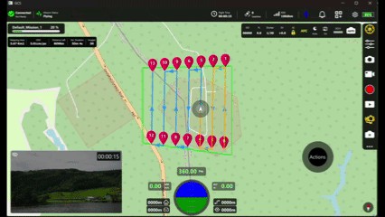

# Ground Control Station

A modern UAV Ground Station UI buit using Qt6/QML

## Screenshots:

### Main UI:

 

## Overview:

Current Version show cases the main action page, which contains:

1. Header Bar containing all the vehicle status
2. Mission Status Bar on the left.
3. Camera Actions Tool bar on top right.
4. Actions Tool Bar on the right side.
5. Camera Preview Window with timer.
6. A HUD at the bottom center of the page
7. A Joystick at the bottom right of the page.
8. A live map overlay
9. A configurable planned mission path of the vehicle
10. Vehicle Current Location
11. Vehicle overlay trail

## Responsive Design

This version of GCS is now responsive to both scale up and down, via the use of Flickables



## Folder Structure

```text
GCS/
│
├── CMakeLists.txt
│   Main CMake configuration file where all modules and libraries are linked
│
├── Main.qml
│   Currently unused
│
└── UI/
    │
    ├── CMakeLists.txt
    │   Contains UI module configuration
    │
    ├── MainWindow.qml
    │   Main QML file of the project
    │   Handles map interaction variables and UI composition
    │
    ├── Layout/
    │   Contains main page layouts
    │
    ├── Map/
    │   Contains all map-related UI elements
    │
    ├── Resources/
    │   Contains icons, images, and graphical assets
    │
    └── Widgets/
        Contains reusable custom UI widgets
```

## Build requirments/system environment:

1. Qt Framework 6.11 version
2. Qt Creator 17.0.0 version
3. Windows 11
4. Cmake minimum version 3.16

## Required Qt Modules
1. Qt Qml
2. Qt Core
3. Qt Core5Compact 
4. Qt Quick
5. Qt Positioning
6. Qt Location

## Future Propspect:
    To develop the cpp side of this project to make the page more lively, by generating fake data.

